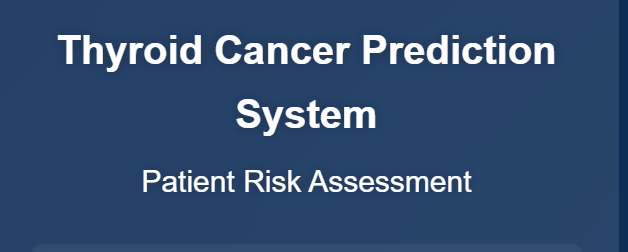
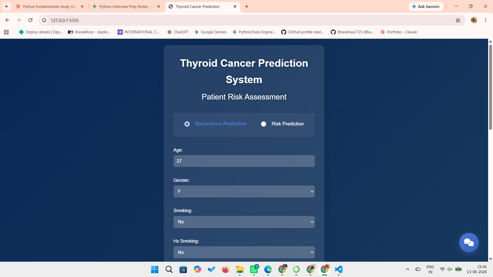

# Thyroid Cancer Prediction System

> A clinical decision-support web application that predicts **Thyroid Cancer Recurrence** and assesses **Patient Risk Level** using machine learning, deployed via a Flask web interface with an integrated AI chatbot assistant.


---

## Demo



## WebAPP 




---

## Overview

The **Thyroid Cancer Prediction System** is a full-stack machine learning web application designed to assist medical professionals in evaluating thyroid cancer outcomes. It provides two core prediction modules:

- **Recurrence Prediction** — Predicts whether thyroid cancer is likely to recur (`Yes` / `No`) based on clinical parameters using an **XGBoost classifier**
- **Risk Assessment** — Classifies patients into `Low`, `High`, or `Intermediate` risk categories using a **Logistic Regression model**

The system also includes an integrated **AI chatbot assistant** to help users navigate the interface and understand predictions.

---

## Features

- **Dual Prediction Modules** — Recurrence Prediction + Risk Assessment in a single interface
- **Built-in Chatbot** — Keyword-based assistant for user guidance
- **ML-Powered Backend** — XGBoost & Logistic Regression models with hyperparameter tuning via PyCaret
- **Responsive UI** — Glassmorphism-styled frontend with mobile support
- **Preprocessing Pipeline** — Automated label encoding, age scaling, and feature selection
- **PyCaret AutoML** — Used to benchmark and select best-performing base models

---

## Results

| Model | Task | Accuracy |
|-------|------|----------|
| **XGBoost Classifier** | Recurrence Prediction | **93.15%** |
| **Logistic Regression** | Risk Assessment | **82.19%** |

### Recurrence Prediction — Classification Report (Test Set, 80/20 Split)

| Class | Precision | Recall | F1-Score | Support |
|---|---|---|---|---|
| No Recurrence (0) | 0.98 | 0.92 | **0.95** | 51 |
| Recurrence (1) | 0.84 | 0.95 | **0.89** | 22 |
| **Macro Avg** | 0.91 | 0.94 | **0.92** | 73 |
| **Weighted Avg** | 0.94 | 0.93 | **0.93** | 73 |

### XGBoost Hyperparameters (Recurrence Model)

```
n_estimators     = 500
learning_rate    = 0.03
max_depth        = 4
min_child_weight = 1
subsample        = 0.8
colsample_bytree = 0.8
gamma            = 0.1
reg_alpha        = 0.5
objective        = binary:logistic
eval_metric      = logloss
random_state     = 42
```

### Logistic Regression Configuration (Risk Model)

```
penalty      = l2
C            = 1.0
solver       = liblinear
class_weight = balanced
max_iter     = 1000
```

Both models were selected via **PyCaret AutoML benchmarking** with 5-fold cross-validation and hyperparameter tuning.

---

## Dataset

| Property | Details |
|---|---|
| **Source** | Thyroid clinical records dataset |
| **Samples** | 383 patients |
| **Features** | 17 clinical attributes |
| **Target (Recurrence)** | Recurred: Yes / No |
| **Target (Risk)** | Risk: Low / High / Intermediate |

### Feature List

| Feature | Type | Description |
|---|---|---|
| Age | Numeric | Patient age |
| Gender | Categorical | M / F |
| Smoking | Categorical | Yes / No |
| Hx Smoking | Categorical | History of smoking |
| Hx Radiotherapy | Categorical | History of radiotherapy |
| Thyroid Function | Categorical | Euthyroid / Hypothyroid / etc. |
| Physical Examination | Categorical | Exam findings |
| Adenopathy | Categorical | Presence of adenopathy |
| Pathology | Categorical | Papillary / Follicular / etc. |
| Focality | Categorical | Uni-focal / Multi-focal |
| T | Categorical | Tumor stage |
| N | Categorical | Node stage |
| M | Categorical | Metastasis stage |
| Stage | Categorical | Overall TNM stage |
| Risk | Categorical | Low / High |
| Response | Categorical | Treatment response |
| Recurred | Categorical | **Target variable** |

---

## Project Structure

```
thyroid-prediction-system/
│
├── app.py                          # Flask application — routes & prediction logic
├── requirements.txt                # Python dependencies
├── README.md                       # Project documentation
├── .gitignore                      # Git ignore rules
│
├── model/                          # Pre-trained model artifacts
│   ├── thyroid_xgb_recur.pkl       # XGBoost recurrence model
│   ├── logistic_risk_model.pkl     # Logistic Regression risk model
│   ├── label_encoders_recur.pkl    # Label encoders (recurrence)
│   ├── label_encoders_risk.pkl     # Label encoders (risk)
│   ├── feature_order_recur.pkl     # Feature order (recurrence)
│   ├── feature_order_risk.pkl      # Feature order (risk)
│   └── age_scaler_risk.pkl         # StandardScaler for age
│
├── templates/
│   └── index.html                  # Main prediction UI
│
├── static/
│   └── css/
│       └── style.css               # Application styling
│
└── results/
    ├── app.gif
    ├── webapp1.png
    ├── webapp2.png
    └── chatbot.png
```

---

## Installation

### Prerequisites

- Python 3.7 or higher
- pip

### Steps

```bash
# 1. Clone the repository
git clone https://github.com/Bhavishas2725/THYROID-PREDICTION.git
cd THYROID-PREDICTION

# 2. (Optional) Create a virtual environment
python -m venv venv
source venv/bin/activate        # On Windows: venv\Scripts\activate

# 3. Install dependencies
pip install -r requirements.txt

# 4. Ensure model files are in the model/ directory
#    (thyroid_xgb_recur.pkl, logistic_risk_model.pkl, etc.)
```

---

## Usage

```bash
# Run the Flask application
python app.py
```

Open your browser and navigate to:

```
http://127.0.0.1:5000/
```

1. Select prediction type: **Recurrence Prediction** or **Risk Assessment**
2. Fill in the clinical parameters in the form
3. Click the **Predict** button
4. View the prediction result instantly
5. Use the **chatbot** (bottom-right button) for guidance

---

## Tech Stack

| Layer | Technology |
|---|---|
| **Backend** | Python, Flask |
| **ML Models** | XGBoost, Logistic Regression, Scikit-learn |
| **AutoML** | PyCaret 3.3.2 |
| **Preprocessing** | Pandas, NumPy, StandardScaler, LabelEncoder |
| **Model Persistence** | Joblib |
| **Frontend** | HTML5, CSS3 (Glassmorphism), JavaScript |
| **Deployment** | Local / Any WSGI server |

---

## API Endpoints

| Method | Endpoint | Description |
|---|---|---|
| `GET` | `/` | Renders the main prediction UI |
| `POST` | `/predict` | Submits clinical data → returns recurrence prediction |
| `POST` | `/predict_risk` | Submits clinical data → returns risk classification |
| `POST` | `/chat` | Sends message → returns chatbot response (JSON) |

---

## Notebook

The full model development pipeline is documented in:

```
Thyroid_Classification_System_Review_-_Final.ipynb
```

This notebook covers:
- Exploratory Data Analysis (EDA)
- Data preprocessing & encoding
- PyCaret AutoML model benchmarking
- XGBoost hyperparameter tuning for recurrence prediction
- Logistic Regression training for risk classification
- Model evaluation (accuracy, classification report, confusion matrix)
- Model serialization with Joblib

---

## Author

**Bhavisha S**  
B.E. Computer Science (AI & ML) — AMET University, Chennai  
📧 bhavishasiva272@gmail.com  
🔗 [LinkedIn](https://linkedin.com/in/bhavishasiva-) | [GitHub](https://github.com/Bhavishas2725) | [Portfolio](https://bhavishas.netlify.app/)

---

## License

This project is licensed under the [MIT License](LICENSE).

---

## Acknowledgements

- Dataset sourced from clinical thyroid cancer records
- [PyCaret](https://pycaret.org/) for automated model benchmarking
- [XGBoost](https://xgboost.readthedocs.io/) for the recurrence classification model
- [Flask](https://flask.palletsprojects.com/) for the web framework

---

> **Disclaimer:** This application is intended for research and educational purposes only. It is not a substitute for professional medical diagnosis or clinical judgment.
